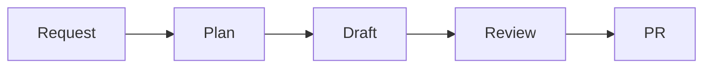

# How Doc Holiday works

Doc Holiday turns a request into a plan, a draft, a review, and a normal pull request.

This is the loop at a glance.

## Stage 1 — intake

A request can start in four places, and each path lands in the same work:

- In git, mention Doc Holiday in a pull request comment. See [Request work in git](/f1-request-work-in-git.md).
- In the app, enter a plain language request. See [Request work in the app](/f2-request-work-in-the-app.md).
- From a configured trigger, a release or merge event starts the work automatically. See [Configure triggers](/d2-configure-triggers.md).
- From CI, the GitHub Action can send the request for you. See [GitHub Action](/g1-github-action.md).

## Stage 2 — plan

Doc Holiday reads the request together with what it already knows about the Publication and its connected Sources. It turns that into one work item for each file, so you can see what it plans to change before it drafts anything. The request and the plan appear in [Work History](/f4-work-history.md).

## Stage 3 — draft

Doc Holiday reads the real source, compares it with the docs it maintains, and drafts proposed diffs. Those drafts stay in Doc Holiday until approval. It never writes straight to the docs repo, so the repo stays unchanged until review finishes.

## Stage 4 — review

You review the draft, leave comments, and ask for changes when something needs another pass. Doc Holiday revises the same work and keeps the draft visible until it is ready. When you approve it, Doc Holiday opens a normal pull request in the docs repo. See [Review and revise](/f3-review-and-revise.md).

Your docs repo stays yours: approved content lands there only as a normal git pull request, and the merged result lives in your repository like any other change.